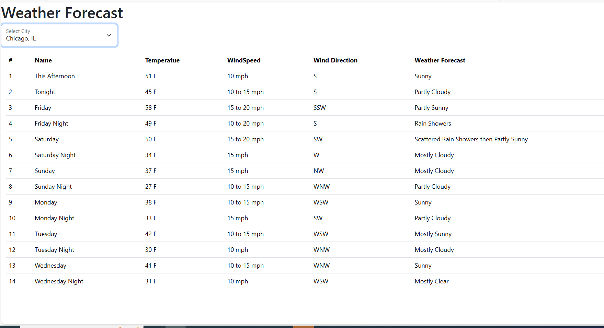

# WeatherForecast
* This Miniproject is all about weather forecasting using weather api's.
* User has to select a city.
* Based on the selcted city we will pass latitude and longitude points to the url
https://api.weather.gov/points/${lat},${long}, this is similar to the https://api.weather.gov/points/32.6791,-97.4641.
* Using the above url we will get the Weather Station for that city as an object.
* Using that weather station object we will get the weather forecast url (https://api.weather.gov/gridpoints/FWD/64,100/forecast).
* using the weather forecast url we will get the forecast data.
* And the weather forecasted data is diaplayed in the form of table.

#### The sample view of the weather forecast data

#### Tools used:
Vs code, Postman, BootStrap

#### Technologies used:
HTML, CSS, JavaScript, Weather API's, Bootstrap

#### Resources
* https://api.weather.gov/
* https://api.weather.gov/points/32.6791,-97.4641
* https://api.weather.gov/gridpoints/FWD/64,100/forecast
